<h1 align="center">Hi 👋, I'm Davide Ladisa a.k.a FrancoStino</h1>

    
     
    
    
    
    
    

I am a developer specialized in <i>Web Development</i>, a Tech Enthusiast, and always eager to learn new technologies 😀

## 👨‍💻 About me

Do you like numbers and charts? Let's see some then:

  
📊 Profile's stats

   
    

      <picture>
        <source
          srcset="./assets/github-stats.svg"
          media="(prefers-color-scheme: dark)"
        />
        <source
          srcset="./assets/github-stats.svg"
          media="(prefers-color-scheme: light), (prefers-color-scheme: no-preference)"
        />
        
      </picture>
    
 
    

      
    
 

  
⌨️ Most used languages

   
  

    
  

  
✨ Top Contributions

   
  

    
  

  
⚡ Activity Graph

   
  

    
  

  
🗄️ Databases

   
  

    
    
  

  
🛠 Projects

   
  

    
  

  
Check out my comprehensive project portfolio with detailed descriptions and technologies used!

  
🏆 My trophies

   
  

    
  

  
✍️ Random Dev Quote

   
  
 

---

  

